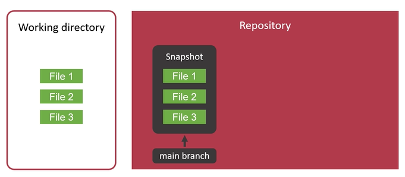
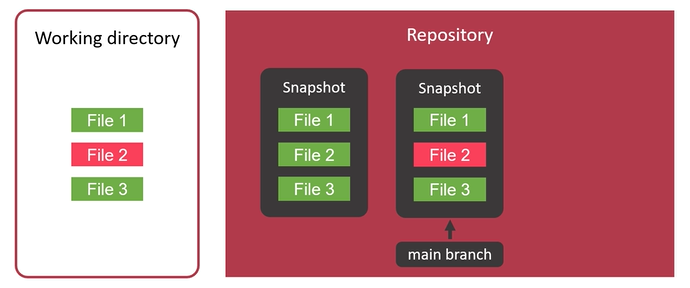
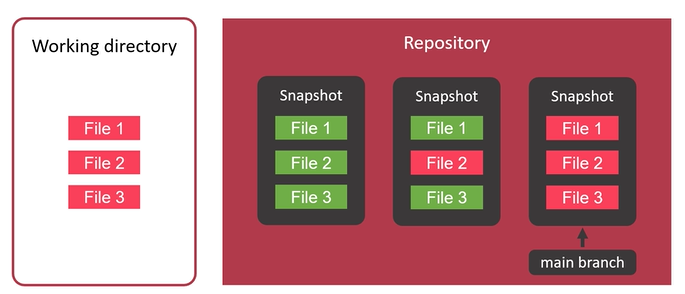
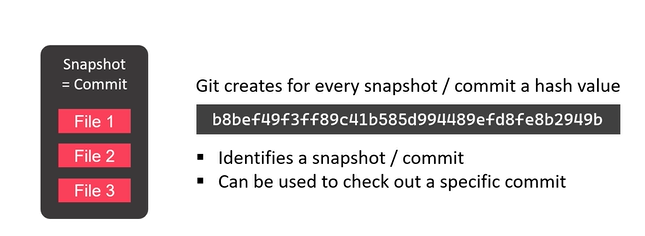

# What are the snapshots?

The term snapshots means a commit. But git does not store single-file differences with a commit. Instead, Git creates a snapshot of all your files, with every commit. Now important to know is that it creates a hash value for every snapshot respectively for every commit. That hash value is a 40-character-long string that looks similar to this one. Such a hash value identifies a snapshot respectively a commit. This means that the hash value can be used to check out a specific commit from your repository. Checking out a specific commit can be useful when you look at the history of your code, and then you can see what was the state of your code with that commit.

