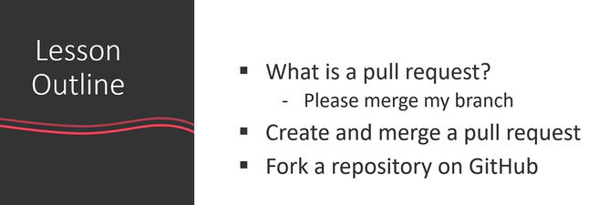
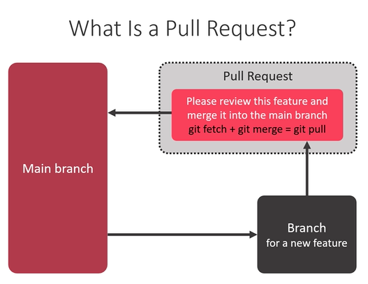
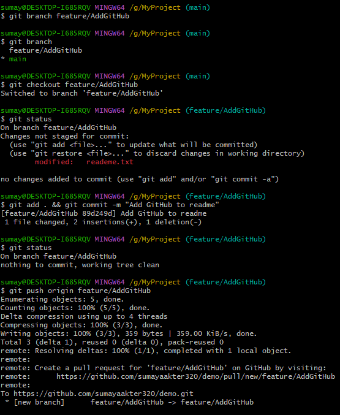

# Git pull request

## What is pull request?

1. First create a new branch
2. add your new features in the new branch
3. then add & commit them and push them to the remote repo
4. reload the browser and you'll get a pull request
5. then pull the request if there is no conflict then you can directly merge the changes or you can also do it using commands in using git. For that follow the next steps -

    - checkout to the main branch
    - then run the command - `git merge branch-name`
    here the branch name will be that branch where we make the changes.
    - now push the changes to the remote repo - `git push`
    - now you can delete the other branches if they are not needed anymore.
