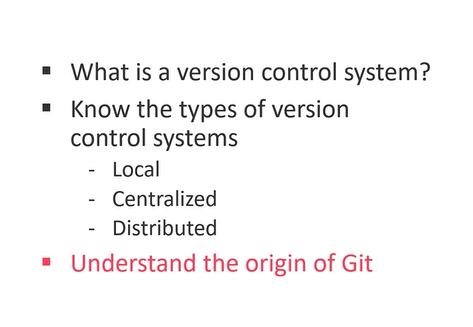

# Version Control System



```A version control system is a tool that helps a software developer to track and save code changes.```


## Local Version Control System

``` markdownlint
In a local version control system you have
a so-called version database on your computer.
This version database stores different versions of your source code.

This version database stores different versions of your source code. From that version database, you can get a file for a specific version. This is also known as a checkout.

It is powerful to track your code changes locally, but it does not support to work together with other developers on the same code base.
```

## Centralized Version Control System

``` markdownlint
To work with other developers centralized version control system works . With a centralized version control system, you have also a version database.

But here the version database is not stored on your computer. Instead, it is located on a central server. This central server is the reason why it is called centralized version control systems.

But as you can see, on your computer, you have only a specific version. To look for example at the history of your source code, or to save changes to your source code, you need a connection to the server. This means without the server, you cannot use the features of the version database.
```

## Distributed Version Control System

``` markdownlint
In a distributed version control system you have also a server, but let's call that not central server, but instead server computer. It is just another computer that has the version database.

Now, on the client computers, you don't check out a single version of the source code. Instead of this, you copy the whole version database to your computer. So, you can see, the version database is distributed across multiple computers. This is the reason why it is called a distributed version control system.
```

## Git is a distributed version control system

``` markdownlint
In Git, the version database is called a repository. The different versions are identified by commits. A commit means that you saved a change of your source code. When you copy the repository from the server to your computer, it means in Git terms that you clone the repository to your machine.
```
