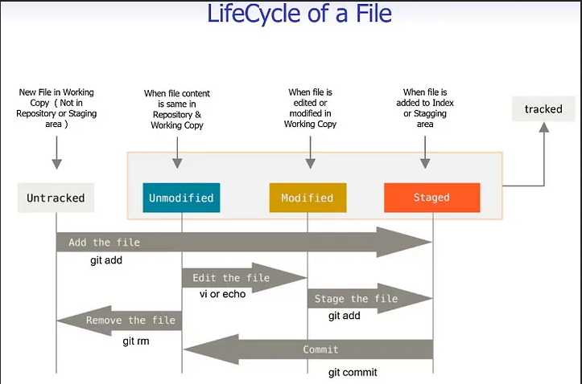

# Working with local repository

To work with a local repository, we need to study three things -

1. How to create a local repository
2. Understand three main areas
3. Work with your repository

## How to create a local repo

First, open git bash and to create a folder follow the following steps -

1. Create a folder (Project) - `mkdir folderName`
2. Go to that created folder - `cd folderName`
3. Open the folder in the explorer - `explorer .`
4. Now, create a .git folder [which is known as initializing the empty git repository] - `git init`
    - The local repository is created. Now you can start coding in your repository.
5. To know the status of your repository - `git status`

Note: If your project branch name is master then make sure to change it to main as you'll see the default
branch name of GitHub is main. To rename the master branch - `git branch -m master main`

## The three main areas

1. Repository - a project with .git folder is called a repository
2. Working Directory - besides the .git folder the project is known as the working directory
3. Staging area - when the changes of the working directory are added to the .git folder,
   it is known as the staging area

## Work with your repository

- Create your first commit
  - To create the first commit -
    - First, add some content to your working directory
    - Now check the status - `git status` [it will give a message to add those contents]
    - To add those content - `git add .` [Now again check the status and it will give the message that changes are to be committed]
    - Now make your first commit - `git commit -m "Commit message - This is my first commit`
    - And check the status of your project
- Look at the history of your code
- ignore files in the working directory
