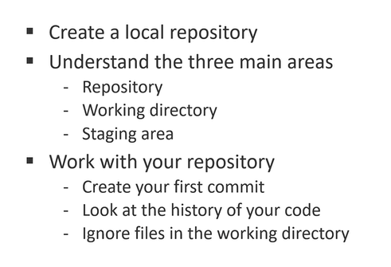

# Working with local repository



## Create a local repository

``` markdownlint
1. mkdir MyProject
2. cd MyProject
3. explorer . => to open the directory in the explorer
4. git init => create a .git folder which is know as initializing empty git repository
```


## Work with your repository

- git status
- create a new file and add some text
- git add .
- git commit -m "My First Commit"


- make again changes in the file and add them by git add .
- before make your next commit, again make changes and see git status
- git diff [file-name] MyProject => To see the differences between two commits
