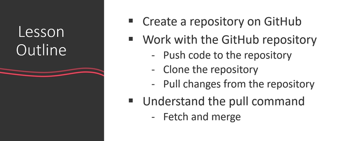
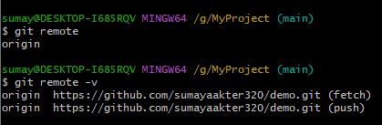
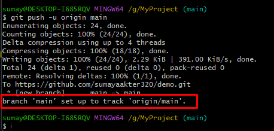
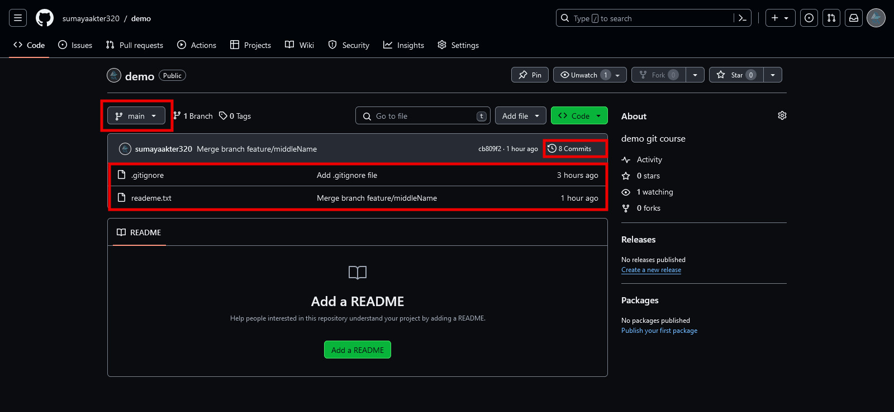
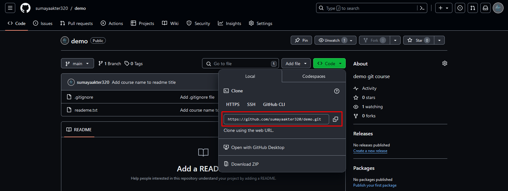
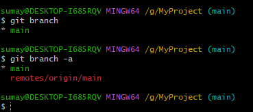
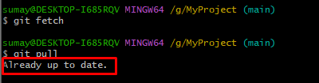
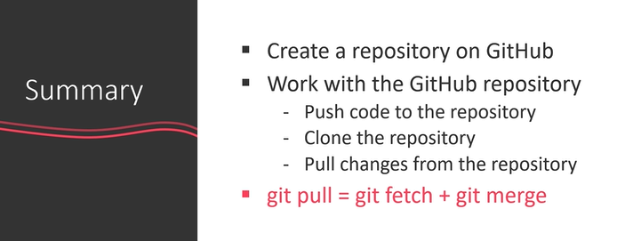

# Working with Remote repo

1. Create a new repository

    ![creating remote repository [part-1]](../images/create_remote_repo.png)

    ![creating remote repository [part-2]](../images/create_remote_repo_2.png)

    ![creating remote repository [part-3]](../images/create_remote_repo_3.png)

2. Remote repo is created

    ![creating remote repository [part-4]](../images/create_remote_repo_4.png)

3. To push your code to the remote repository follow the following steps/commands
    - `git remote add origin remote-repository-link`
    - `git push -u origin main`
    - `git remote`
    - `git remote -v`
    
    - push to the remote repo
        - `git push origin main` or
        - `git push -u origin main` - this means next time you don not need to write `origin main` only `git push` will work
        
    - Now refresh the browser.
    
    -`git remote show origin`

## Cloning remote repo locally

- `git clone remote-repo-link .` [if you do not download the remote repo main folder but only the contains then after the remote-repo-link use a full-stop(.)]
- `explorer .` -> to open the repo folder in explorer

- `git remote -v`
- `git remote show origin`

## Pull changes from the remote repository

- `git pull` or `git pull origin main` - to pull changes form remote repo to your local branch

- `git fetch`
- `git merge`

### Note

- ekta main local repo
- ekta copy-main local repo
- make change in main local-repo and push to the remote repo
- then check status of copy-main local repo. It'll say `Your branch is behind 'origin/main' by 1 commit` and it'll instruct you to use `git pull`
- Now question is that what the git fetch command do? -
  - The `git fetch` command copy the contents to a hidden branch name `remote/origin/main`. Like this -
  
  - To see the hidden branch name - `git branch -a`
  - Now merge the changes (copy kora contents merge korte) - `git merge origin/main`

- git fetch is great for grab the changes from the remote repo
- then merge the changes to your local branch
  - 

## Summary

